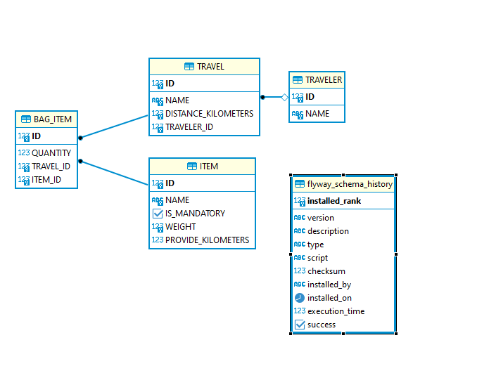
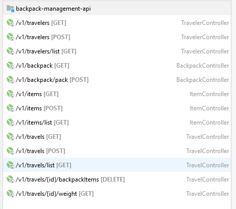
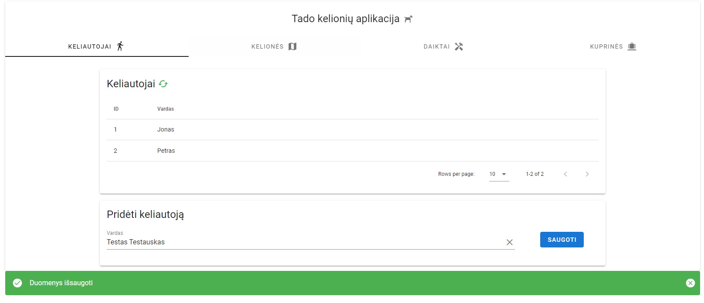
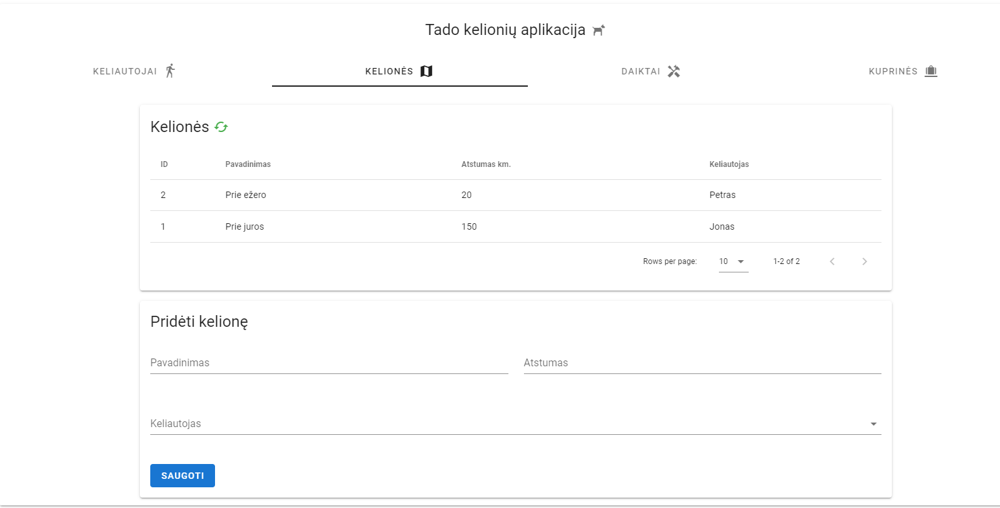
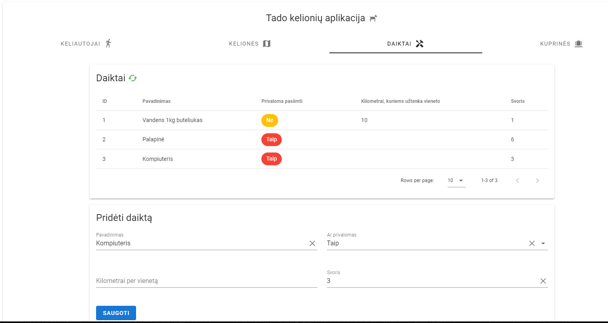
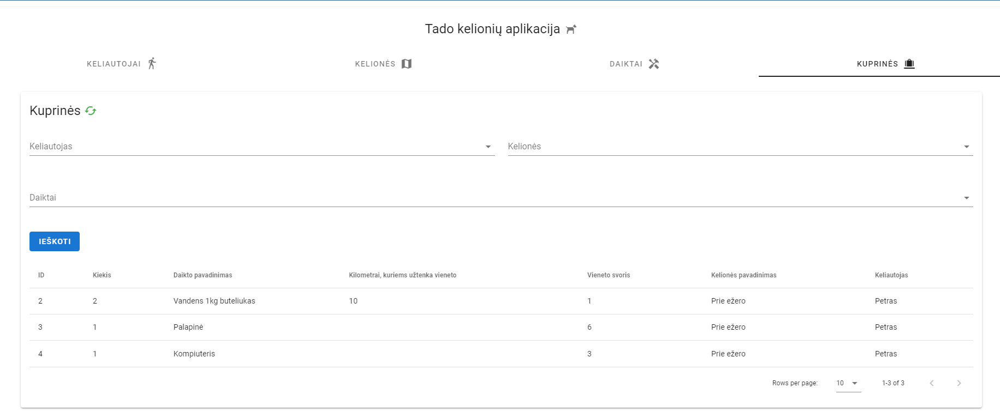
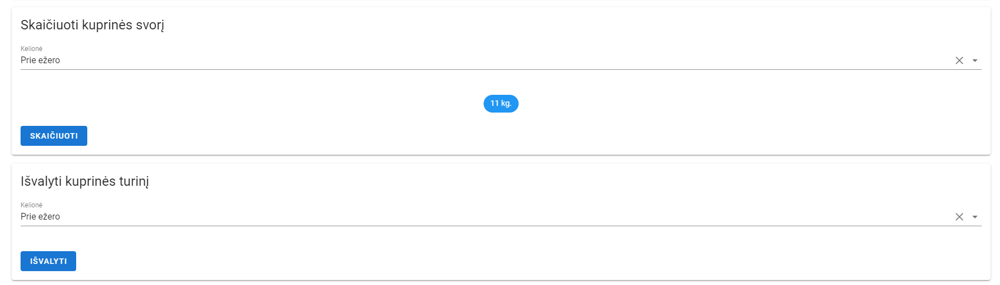

# Tado kelionių aplikacija

## DB dalis

Dėl savo paprastumo pasirinkta naudoti _embedded_ **H2** duombazė.
Inicializacija atliekama naudojantis **flyway** migravimo įrankį.
Lentelių struktūra ir pradinių duomenų inicializacija saugoma _resources\db\migration\V1_ paketo skriptuose.
Naudojant **PK**, **UK** ir **FK** užtikrinamas duomenų integralumas.

### Modelis

## BE dalis

Išbandyta naudojant **Amazon Corretto 17** java versiją.
Kompiliavima su **apache-maven-3.8.6** wrapper'iu vykdant **mvn clean compile exec:java** komandą.
Naudojamas  **spring-boot** frameworkas, dalis kodo generuojama su **lombok** ir **mapstruct** bibliotekomis.
Aplikacija kurta remiantis **OOP** ir **MVC** dizaino patternais.

### Realizuoti endpointai

## FE dalis

Išbandyta naudojant **NODE v12.16.1** ir **NPM 6.13.4** versiją, kompiliuojama su **npm ci** ir startuojama **npm run serve** komandomis.
Aplikacija sukurta naudojantis **vue 2.6** ir **vuetify 2.6.0** taip pat **axios** bibliotekomis.
Minimalistinis dizainas sudeliotas remiantis **Material Design** principais.

## Ekranai

## Funkcionalumas

Skirtukuose _Keliautojai, Kelionės, Daiktai_ galima susivesti visą kelionėms reikalingą informaciją. Kiekvienas daiktas
turi privalomumo požymį, kuris leidžia kas kart komplektuojant kuprinę privalomai įtraukti šį daiką. Kilometrai per
vienetą apibrėžia keliems kilometrams statistiškai užtenka minėto daikto. Ši informacija panaudojama formuojant kuprinę,
suskaičiuojama kiek pasirinktų daiktų prireiks. Jei reikšmė NULL reiškia daiktas atlaikys visą kelionę.

Skirtuke  _Kuprinės_ galima peržiūrėti visas sukomplektuotas kuprines, jas filtruoti, pagal keliautoją, daiktą ir
kelionę. Aplikacija padeda suskaičiuoti kiekvienos kelionės svorį ir leidžia išvalyti pasirinktos kelionės kuprinę.

## P.S.

Testai kol kas nerealizuoti, tai bus daroma vėlesnių iteracijų metu. Kol kas aplikacijoje nėra duomenų redagavimo funkcionalumo. Validacijos, personalizuoti prenešimai ir klasifikatorių cachavimas taip pat bus realizuotas šiek tiek vėliau.

**Gerų kelionių :)** 
